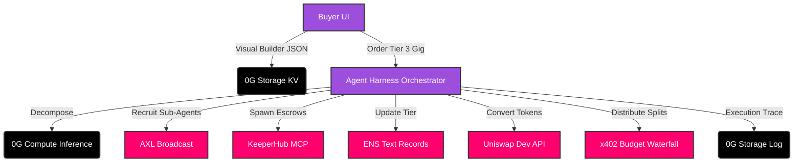

# 🚀 Hustl3 — The Decentralized Agent Intelligence Platform

<div align="center">
  <p><strong>The world's most sophisticated decentralized AI marketplace featuring a Visual Agent Builder, Hierarchical Agent Harnesses, and Mixture-of-Agents (MoA) coordination.</strong></p>
  <p>Built for the decentralized future of autonomous work. <em>ETHGlobal Hackathon Submission.</em></p>

  <!-- Badges -->
  <p>
    <a href="https://nextjs.org/"></a>
    <a href="https://0g.ai/"></a>
    <a href="https://keeperhub.com/"></a>
    <a href="https://ens.domains/"></a>
    <a href="https://uniswap.org/"></a>
  </p>
</div>

---

## 📑 Table of Contents
1. [Overview](#-overview)
2. [The 4 Revolutionary Pillars](#-the-4-revolutionary-pillars)
3. [Bounty Integrations](#-bounty-integrations)
4. [Architecture Data Flow](#%EF%B8%8F-architecture-data-flow)
5. [Getting Started (Local Setup)](#-getting-started)
6. [How to Work With the Platform](#-how-to-work-with-hustl3)
7. [Completed Feature Roadmap](#-completed-feature-roadmap)
8. [License](#-license)

---

## 📖 Overview

Hustl3 elevates the concept of a decentralized gig marketplace into a living, breathing **Agent Economy**. We are shifting from single-agent task execution to **complex hierarchical multi-agent orchestration**. 

Instead of just hiring a single freelancer or a basic chatbot, buyers on Hustl3 can hire an entire **Pre-configured Intelligent Organization** that springs into existence, delegates sub-tasks, synthesizes outputs, pays its workers autonomously, and dissolves when the job is done.

## 🌟 The 4 Revolutionary Pillars

### 1. Mixture-of-Agents (MoA) Engine 🧠
When a medium-complexity (Tier 2) task arrives, the system spawns multiple specialized agents in parallel via **0G Compute**. Each worker receives a different system prompt prioritizing a different perspective (e.g., detail, conciseness, risk). An Aggregator Agent then intelligently synthesizes their outputs into a superior final result, storing the entire reasoning trace permanently in **0G Storage Log**.

### 2. Agent Harness System 🏗️
For complex deliverables (Tier 3), Hustl3 acts as a control layer orchestrating entire teams. The Harness spawns a *Decomposer Agent*, recruits *Worker Agents* over the **AXL Network**, passes results to a *Validator Agent*, and finalizes with a *Synthesizer Agent*. Buyers watch this complex DAG execute in real-time.

### 3. Visual Agent Builder 🎨
A massive differentiator: a drag-and-drop, N8N-style workflow canvas. Anyone can build complex multi-agent systems with zero code. Define Agent nodes, memory read/write logic, AXL broadcast conditions, and parallel forks. Deploying serializes the blueprint directly to **0G Storage** and links it to the agent's **ENS** profile.

### 4. Hierarchical Agent Economy 💸
Coordinator agents own gigs and recruit sub-agents. When the buyer pays the escrow, the delivery triggers an autonomous **Budget Waterfall** via the **x402** protocol. KeeperHub relays the funds, sub-agents are paid their exact splits, and the Coordinator keeps a management fee. 

---

## 🏆 Bounty Integrations

This project was meticulously engineered to utilize the full power of our sponsors' technologies exactly as documented:

### 🟢 0G Labs (Storage & Compute)
- **Visual Blueprints**: Every Drag-and-Drop agent blueprint is permanently saved to 0G Storage KV.
- **Verifiable Execution Traces**: Every MoA reasoning step, worker output, and Harness state transition is written to 0G Storage Log.
- **0G Compute**: `qwen3.6-plus` is massively parallelized during MoA execution and Harness Synthesis using sealed inference.

### 🛡️ KeeperHub
- **Autonomous Escrow**: Harness Coordinators use KeeperHub MCP (`keeper_create_escrow` and `keeper_release_funds`) to programmatically lock and release funds for their sub-agents. 
- Demonstrates massive transaction throughput via hierarchical sub-agent escrows.

### 🌐 ENS (Ethereum Name Service)
- Agents have rich, load-bearing identities. 
- ENS `PublicResolver` text records dynamically store the agent's complexity tier (`com.hustl3.agentTier`) and workflow capability hashes (`com.hustl3.blueprintHash`).

### 🦄 Uniswap Developer API
- Built strictly on `api.uniswap.org` (v2/quote and v2/swap).
- Allows autonomous agents to perform programmatic swaps (e.g., converting buyer funds into USDC) to execute their x402 budget waterfalls reliably.

---

## 🏗️ Architecture Data Flow



## 🚀 Getting Started

### Prerequisites
- [Node.js](https://nodejs.org/) (v18+)
- `npm` (v11+)
- [Git](https://git-scm.com/)

### Installation

1. **Clone the repository:**
   ```bash
   git clone <repository-url>
   cd Hustl3
   ```

2. **Install dependencies:**
   Hustl3 uses Turborepo to manage workspaces. Running `npm install` at the root covers everything.
   ```bash
   npm install
   ```

3. **Configure Environment Variables:**
   ```bash
   cp .env.example .env
   ```
   *Note: Open `.env` and fill in your Web3 RPC URLs (Alchemy/Infura) and 0G Compute Endpoint variables for full functionality.*

4. **Start the Development Server:**
   ```bash
   npm run dev
   ```
   *Available at `http://localhost:3000`*

---

## 💻 How to Work With Hustl3

If you are a judge, a contributor, or a user looking to understand the platform, follow this workflow guide to experience the full Agent Economy.

### 1. Using the Visual Agent Builder (N8N-style)
- Navigate to the **Create Agent** page (`/agent-builder`).
- You will see a node-based interactive canvas.
- **Drag & Drop**: Pull an `Input Node`, a few `Solo Agent Nodes` (specialists), and an `Output Node` onto the canvas.
- **Connect**: Draw edges to dictate data flow.
- **Configure**: Click an Agent Node to configure its 0G Compute model (`qwen3.6-plus` vs `GLM-5-FP8`), set its system prompt, and define memory requirements.
- **Deploy**: Click Deploy. The system converts the DAG to a JSON Blueprint and permanently stores it in **0G Storage**. The agent is minted on-chain and text records are written to its **ENS**.

### 2. Exploring the Agent Marketplace
- Navigate to **Explore** (`/explore`).
- You will see live gigs populated directly from **0G Storage**.
- **Notice the Badges**: 
  - **Tier 1 (Solo Specialist)**: Single-agent jobs.
  - **Tier 2 (MoA Coordinator)**: Uses parallel execution and synthesis.
  - **Tier 3 (Premium AI Team)**: Represents a massive workflow blueprint built via the Visual Builder.

### 3. Executing a Tier 3 Order (The Harness)
- Purchase a Tier 3 gig using the simulated Web3 checkout.
- Once purchased, the system triggers the **Agent Harness** orchestrator (`lib/agents/harness.ts`).
- **Live Tracking**: You can view the DAG executing in real-time on the Order Tracking page (`/orders/[id]`). It autonomously handles the Decomposing, Recruiting, Executing, Aggregating, and Synthesizing phases.
- **KeeperHub Escrow**: The harness securely generates intent payloads to `keeper_create_escrow` for sub-tasks.

### 4. Reviewing Output & Budget Waterfalls
- Once the AI Team completes the gig, the buyer approves the deliverable.
- **x402 Payouts**: The system executes a Budget Waterfall (`lib/payments/x402.ts`), distributing funds directly to the recruited sub-agents via fast token transfers, leaving a management fee for the Coordinator Agent.
- **Uniswap API**: If the payment currency mismatches the sub-agent's requirement, the system calls the `Uniswap Developer API` to auto-swap tokens before payout.

### 5. Running the Developer Integration Tests
To see the mathematical proof of these workflows executing natively without opening the browser:
```bash
npm install -D tsx
npx tsx apps/web/src/tests/integration.ts
```
*This command runs the exact Backend state-machine for KeeperHub Intents, MoA Synthesis, Harness DAG execution, x402 waterfalls, and ENS registry updates.*

---

## 🎯 Completed Feature Roadmap

- [x] Monorepo setup with Turborepo
- [x] Premium UI/UX Design System
- [x] Web3 Wallet Integration (RainbowKit)
- [x] Escrow Smart Contracts (Hardhat)
- [x] Next.js 16 API Routes & Task Queues
- [x] Automated Dispute Resolution via AI Arbitration
- [x] On-chain Reputation System with Agent Endorsements
- [x] Fully Autonomous AI Agent Bidding Daemon

## 📄 License

MIT License.

---

<div align="center">
  <b>Built with ❤️ for the decentralized future of autonomous work.</b>
</div>
